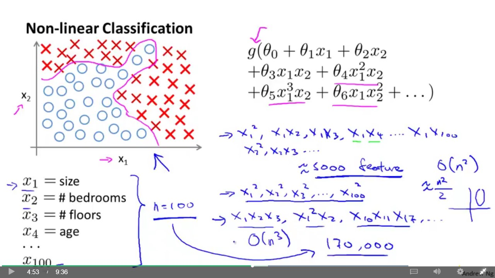
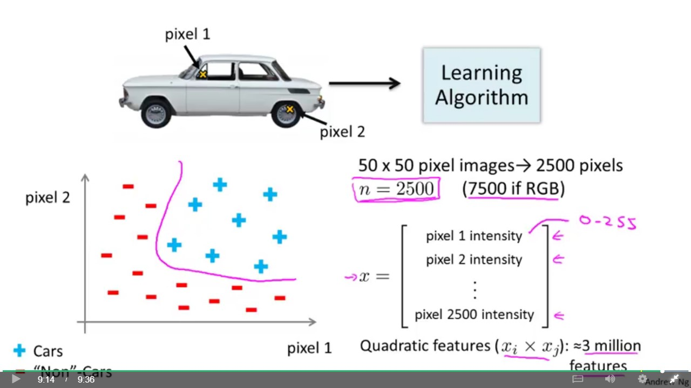

## Neural Networks

### Non Linear Hypothesis
1. For a complex non linear boundary we can use combination of different features.
2. As the number of feautres increases, our combination of features approach become computationally expensive.
3. Say we have 100 features and we use combinations of two features in each term. So that comes out to be order of O(n^2)/2.
4. The number of features become too large and obviously the computations become too large as well.
5. So for a small n the classification approach works well but for large n or non linear hypothesis we may need to think of something else.

>

6. For an image suppose we take a 50 X 50 image we have values for 2500 pixel values. The brightness of the pixels determine the object in the image. If we go for a combination of squares of the features then we will have close to 3 million features which is not a feasible approach.

>

### Model Representation
1. A neuron is a computational unit that recieves some input and gives an output.
2. We add a bias unit i.e. x0 which is essentially equal to 1
3. The computation that the neuron performs is called a activation function.
4. Theta is called weights or parmaeters of the model
5. Neural Network means a group of neurons string together.

6. There is a concept of hidden layer, input layer and output layers

7. Whenever we are mapping, the number of theta parmaeters/weights are of the dimension S(J+1) X S(J)+1 where S(J+1) are the number of neurons in the J+1 layer and S(J) are the number of neurons in J layer.

8. In the pic below answer is 4 X 3

